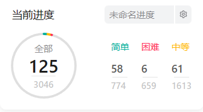

# Days-01

## 环境和编辑器要求
老样子，Anaconda3、pycharm、vscode三件套，环境配置已熟悉

## 文本编辑器
Jupyter Notebook，sublime_text这两个够用

## 语言元素、分支结构、循环结构

刷了一个月，算法渣渣只能刷到这种地步，不过python的基础在leetcode上把简单题刷到差不多30道题就可以学好了

## 程序逻辑
常见的就是斐波那契数列、反转数、素数

#### 斐波那契数列

这一块常用的就是递归，可定义一个函数f(),记住N的初始状态，若N<2,则返回N,若N>=2，则返回f(N-1)+f(N-2)

#### 反转数

反转数运算有以下规律：

个位 = N % 10

十位 = N // 10 % 10

百位 = N // 100

...

#### 素数

设输入的数为num，则设i在(2,num)此范围中依次遍历，若num%i==0，则num不为素数，相反则为素数

## 函数的模块和使用

关于如何构建函数，之前刷的leetcode对于如何定义函数及参值有了个清晰的理解

## 字符串常用的数据结构

将字符串的第一个字符转换为大写

capitalize()

返回str在string里面出现的次数

count()

以encoding指定的编码格式编码字符串
encode(encoding='UTF-8',errors='strict')

检查字符串是否以suffix结束
endswith(suffix,beg=0,end=len(string))

检查str是否包含在字符串中

find(str)

如果字符串至少有一个字符并且所有字符都是字母或数字则返 回 True，否则返回 False

isalnum()

如果字符串至少有一个字符并且所有字符都是字母或中文字则返回 True, 否则返回 False

isalpha()

如果字符串只包含数字则返回 True 否则返回 False

isdigit()

如果字符串中包含至少一个区分大小写的字符，并且所有这些(区分大小写的)字符都是小写，则返回 True，否则返回 False

islower()

如果字符串中只包含数字字符，则返回 True，否则返回 False

isnumeric()

如果字符串中只包含空白，则返回 True，否则返回 False

isspace()

如果字符串是标题化的(见 title())则返回 True，否则返回 False

istitle()

如果字符串中包含至少一个区分大小写的字符，并且所有这些(区分大小写的)字符都是大写，则返回 True，否则返回 False

isupper()

以指定字符串作为分隔符，将 seq 中所有的元素(的字符串表示)合并为一个新的字符串

join(seq)

转换字符串中的小写字母为大写

upper()

检查字符串是否只包含十进制字符，如果是返回 true，否则返回 false

isdecimal()

